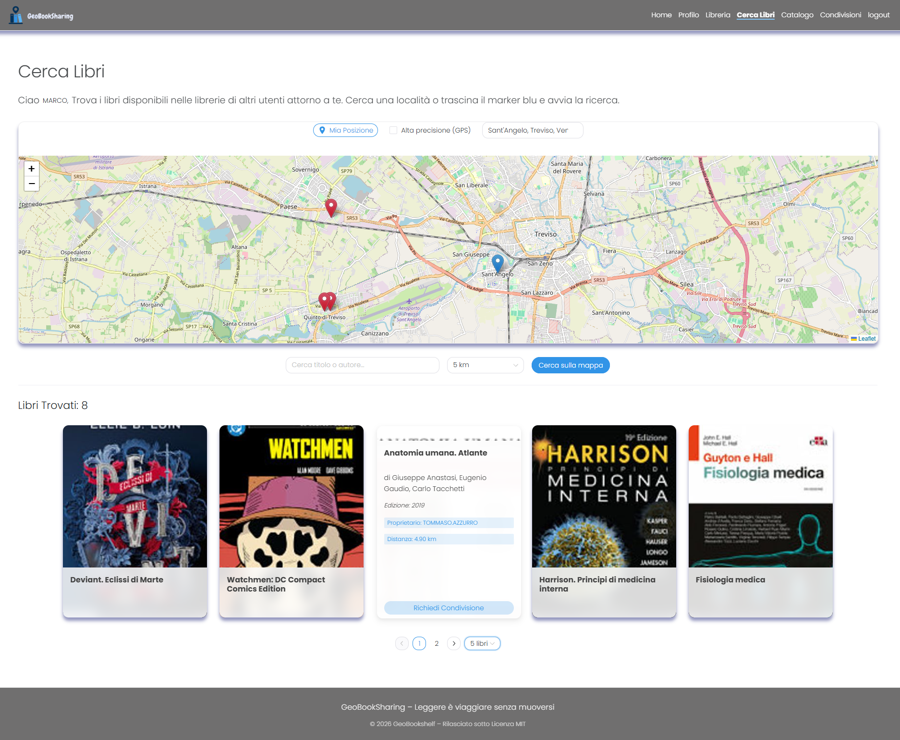

# GeoBookSharing

**GeoBookSharing** è una WebApp progettata per favorire la condivisione "peer-to-peer" del patrimonio librario privato. Il sistema sfrutta la geolocalizzazione per connettere utenti residenti in prossimità, permettendo lo scambio di libri basato sulla posizione geografica reale.

<p align="center">
  
</p>


> **Disclaimer sui dati di test**\
 Tutti i dati contenuti nel presente progetto (nomi, email, password) sono inventati al solo scopo dimostrativo e **NON** contengono informazioni reali riguardanti persone o organizzazioni esistenti. Gli avatar degli utenti sono generati tramite [IA](https://gemini.google.com/) e non fanno riferimento a persone reali.
>
> **Dati Personali Immaginari**\
 Tutti i nomi, cognomi, indirizzi email, biografie e log delle attività appartengono a utenti inventati. Qualsiasi somiglianza con persone, indirizzi o eventi reali è puramente casuale.
>
> **Dati di Geolocalizzazione (PostGIS)**\
Le coordinate geografiche presenti nel database (ad esempio nella tabella scaffali) sono state utilizzate unicamente per testare e dimostrare il funzionamento delle query spaziali dell'applicazione. Sebbene i punti possano ricadere su una mappa reale, sono stati assegnati in modo arbitrario e non corrispondono ad abitazioni, posizioni o spostamenti di utenti reali.
>
>**In un ambiente di produzione reale, la privacy e la sicurezza dei dati degli utenti vengono trattate con la massima priorità e nel pieno rispetto delle normative vigenti (es. GDPR). Nessun dato personale, sensibile o di geolocalizzazione di utenti reali verrebbe mai esposto o pubblicato in questo modo**
>

## Tecnologie Utilizzate

### Frontend

* **Vue.js 3** (Composition API)
* **Pinia** (State Management)
* **Naive UI** (Libreria Componenti)
* **Leaflet** (Mappe interattive)
* **Vite** (Build tool)

### Backend

* **Node.js & Express**
* **Prisma ORM**
* **PostgreSQL** con estensione **PostGIS** (Dati spaziali)

### Infrastruttura

* **Docker & Docker Compose**

---

## Requisiti Minimi

Per eseguire l'intero ecosistema su un nuovo PC, **non** è necessario installare Node.js o PostgreSQL. È richiesto solo:

* [**Docker Desktop**](https://www.docker.com/products/docker-desktop/)  (per Windows o Mac) oppure **Docker Engine** (per Linux).

---

## Guida all'avvio rapido

Segui questi passaggi per configurare l'ambiente in pochi minuti:

### 0. **Verifica lo stato di Docker**
Prima di lanciare i comandi, assicurati che il motore di Docker sia in funzione:
* **Verifica visiva:** Se sei in ambiente Windows l'icona della balena nella barra di sistema deve essere presente.
* **Verifica da terminale:** Esegui il comando `docker ps`. Se ricevi un messaggio di errore (daemon not running), **avvia Docker Desktop** e attendi il caricamento completo.


### 1. **Clona il progetto o copia la cartella:**
* **Via Terminale (Raccomandato):**
    ```bash
    git clone https://github.com/robertom-wq/GeoBookSharing
    cd GeoBookSharing
    ```
* **Senza Git (Download Diretto):**
    1. Clicca sul tasto verde **"<> Code"** e seleziona **"Download ZIP"**.
    2. Estrai l'archivio sul tuo PC (otterrai la cartella `GeoBookSharing-main`).
    3. Entra nella cartella tramite terminale:
    ```bash
    cd GeoBookSharing-main
    ```


### 2. **Importante!!: Rinomina i file .env_example e aggiungi chiave API nel file GeoBookSharing_backend/.env :**
- GeoBookSharing_backend/.env_example ->  GeoBookSharing_backend/.env
- GeoBookSharing_frontend_vue/.env_example ->  GeoBookSharing_frontend_vue/.env
- Aggiungere chiave API fornita nell'elaborato all'interno di **GeoBookSharing_backend/.env**, oppure una in tuo posseso.

### 3. **Avvia i container con build automatica:**
```bash
docker-compose up --build

```


>*Nota: Durante il primo avvio, Docker scaricherà le immagini, installerà le dipendenze (npm install) e popolerà il database. L'operazione potrebbe richiedere alcuni minuti*

### 4. **Accedi ai servizi:**
* **App Frontend:** [http://localhost:5173](http://localhost:5173)
* **API Backend:** [http://localhost:3000]
* **Utenti di test**: 
Puoi utilizzare le seguenti credenziali per testare i diversi livelli di accesso:


| username | password | ruolo | note
| :--- | :--- | :--- | :---
| marco.rossi | password | admin | Accesso completo a gestione utenti/libri
| greta.rosa | password | user | Visualizzazione e gestione propri scaffali
| silvia.nero | password | user |
| francesco.marrone | password | user |
| tommaso.azzurro | password | user | 
| davide.arancio | password | user |
| utente.bannato | password | user | Utente bannato - Login vietato

>Nota: Tutti i dati (nomi, email, credenziali) sono generati casualmente a scopo dimostrativo e non si riferiscono a persone reali.

## Database e Persistenza

Il database viene inizializzato automaticamente grazie allo script contenuto nella cartella `db-init/`.

* **Inizializzazione:** Al primo avvio, lo script `init.sql` crea le tabelle, abilita PostGIS e inserisce i dati di test (Libri e Utenti con coordinate geografiche).
* **Persistenza:** I dati rimangono salvati anche se i container vengono fermati, grazie al volume Docker `geobook_data`.

### Come resettare il database

Se si desidera eliminare tutte le modifiche e tornare ai dati iniziali di test:

```bash
docker-compose down -v
docker-compose up

```

*(Il comando `down -v` distrugge il volume dei dati, forzando Docker a rieseguire lo script SQL di inizializzazione).*

---

## Struttura della Repository

```text
.
├── GeoBookSharing_backend/       # Server Express, Prisma Schema e Logica
├── GeoBookSharing_frontend_vue/  # Web App Vue 3 con Pinia e Naive UI
├── db-init/                      # Script SQL per il popolamento automatico (init.sql)
├── diagrammi_uml                 # Diagrammi UML del progetto
├── screenshot_applicazione       # Screenshot dell'applicazione lato Frontend
├── docker-compose.yml            # Orchestrazione di Database, Backend e Frontend
└── README.md                     # Documentazione del progetto

```

---

## 👤 Autore

* **Roberto Marongiu**

---
